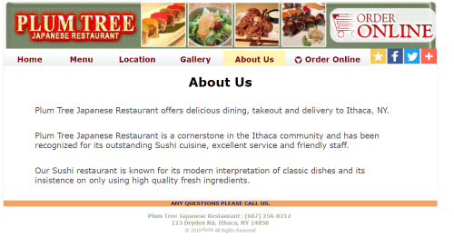
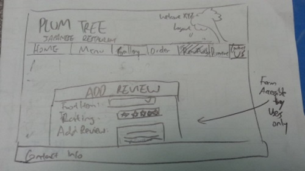
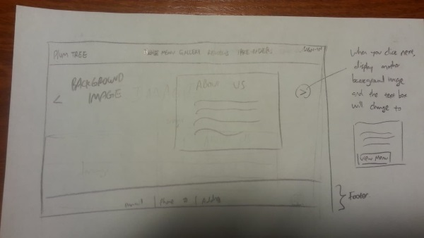
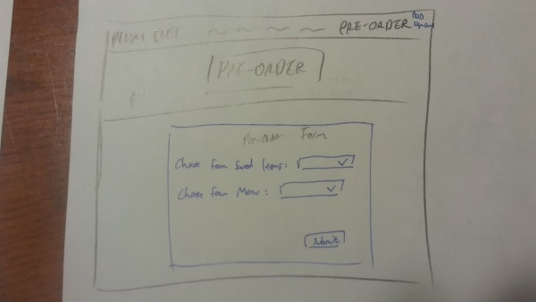

# Project 4: Design Journey

Your Team Name: Golden Shark

**All images must be visible in Markdown Preview. No credit will be provided for images in your repository that are not properly linked in Markdown. Assume all file paths are case sensitive!**


## Client Description

[Tell us about your client. Who is your client? What kind of website do they want? What are their key goals?]
[NOTE: If you are redesigning an existing website, give us the current URL and some screenshots of the current site. Tell us how you plan to update the site in a significant way that meets the final project requirements.]

Our client will be Plum Tree Ithaca. We are looking to redesign their website to make it more modern, intuitive, and with additional functionality. Their key goal is to improve their current website's functionality and design.

This is their current website: http://www.plumtreeny.com/menu.aspx
Currently, their menu page is linked to another website that displays the different food and their prices. We are planning on creating a database to incorporate the menu into one website instead of being linked to another website. We will also add photos via a databse into their  "Gallery" page because currently there are no images under "Gallery". We will add a photo gallery for each of the menu item. We are thinking about adding a customer reviews page. Only current users (only those who are logged in) can write reviews about their dining experience and rate each dish. These reviews can be associated with the food the customers ordered or general reviews. We are also thinking about implementing a user login function so that people can "preorder" food. Users can add the food they want into a basket so that it is easier for them to place an order via phone, etc. We could also implement a reservation form (Date, Time, Part Size).





## Meeting Notes

[By this point, you have met once with your client to discuss all their requirements. Include your notes from the meeting, an email they sent you, or whatever you used to keep track of what was discussed at the meeting. Include these artifacts here.]


We reached out to our client over the phone and they agreed to give us permission to redesign their website. They did not demand anything specific over the phone, however, we are planning on meeting with the client in person this upcoming week in order to collect more background information about their needs.

## Purpose & Content

[Tell us the purpose of the website and what it is all about.]

The purpose of the website is for customers to know what is being served at Plum Tree (their menu). Users can also place an order online. However, their website is poorly designed to meet its function because its menu is actually on another website and so is its "Order Online" function. The menu is rather large (long list of items), and we are seeking to categorize all of the menu information into a database so it will be easier for users to access. In addition, there are no pictures in the Gallery page; hence, Plum Tree might seem less appealing to diners.

## Target Audience(s)

[Tell us about the potential audience for this website. How, when, and where would they interact with the website? Get as much detail as possible from the client to help you find representative users.]

The potential target audience will be the audience of the client, which are potential customers to Plum Tree. They will most likely be people affiliated with Cornell University (e.g. students, staff, professors, etc.) or other residents who live in Ithaca. According to Plum Tree, a lot of students dine/order take out from them. A lot of organizations also host date nights there. They are most popular during the evenings, specifically during the weekends. Users would interact with the website to log in, create an acconut, filter through the menu and create their own custom orders that they can save for future reference.

## Client Requirements & Target Audiences' Needs

[Collect your client's needs and wants for the website. Come up with several appropriate design ideas on how those needs may be met. In the **Rationale** field, justify your ideas and add any additional comments you have. There is no specific number of needs required for this, but you need enough to do the job.]

Example:
- (_pick one:_) Client Requirement/Target Audience Need
  - **Requirement or Need** [What does your client and audience need or want?]
    - Client wants to cater to people who speak different languages.
  - **Design Ideas and Choices** [How will you meet those needs or wants?]
    - Create web-pages manually in multiple languages.
  - **Rationale** [Justify your decisions; additional notes.]
    - Create multiple pages in multiple languages manually.


## Initial Design

[Include exploratory idea sketches of your website.]





## Information Architecture, Content, and Navigation

[Lay out the plan for how you'll organize the site and which content will go where. Note any content (e.g., text, image) that you need to make/get from the client.]

- **Navigation**
  -Home
  -Menu
  -Gallery
  -Order
  -Reviews
  -Directions
  -Contact Us (footer)

- **Content**
  - *Home* : include information on their current "About Us" page. Can add images to the home page too.
  - *Menu* : Categorize the food options into different categories so it is easier for users to know what options there are. Users should be able to see the menu and save items that they can add to their order. Users should also be able to see what they have placed in their order basket while browsing the menu.
  - *Gallery* : include a picture of each dish on the menu or if that is not possible, a picture of each Chef's Special dish, need to get images from the client; add a search function that allows users to search for specific dishes by keywords.
  - *Order* : allows users to place an order via a form asking for Name, Delivery Address, Items Ordered, Payment Methods. After the user clicks on submit, we calcualte an estiamted delivery time and informs the user that a driver is on the way.
  - *Reviews*: allows users who are logged in to rate specific dishes (on a scale of 1-5) and write a brief description regarding each dish.
  - *Directions* : include map on how to get to Plum Tree
  - *Contact Us* : include the hours and address and phone number

- **Process**
[Document your process, we want to see how you came up with your content organization and website navigation.]
- We first started out with a navgiation bar, which includes a Home page, a Menu, a Gallery, and a Directions Page, as well as a footer including all the social media links of Plum Tree.
- After discussing with the group members, we decided to also implement a reviews page that allows users to rate each individual dish since the popularity/rating of each dish could be helpful for future prospective customers who choose to dine in at Plum Tree.
- Regarding the gallery, we decided to implement a four column format displaying images of each dish (or Chef's Special or whatever images that we can get from the client) and each image can be linked to a separate page showing previous ratings of that specific dish.
- For the order page, we decided to implement a form where we collect the necessary user information (Name, Phone Number, Delivery Addres, etcf) and return a "Order Succeesfully Placed" message after the user inputs all the necessary information.


## Interactivity

[What interactive features will your site have? What PHP elements will you include?]

The primary PHP elements will be the login/logout system used to keep track of the users orders. We will not be able to actually complete the order transactions, but we will be able to have users filter through the menu and save which they want. There will also be minor forms of interactivity, such as page indicators, templates to display elements across the site, and ways to print items from the database.

[Also, describe how the interactivity connects with the needs of the clients/target audience.]
The target audience will like to be able to order online and get information about their order. The order form will allow users to know the total price of their order, the wait time and how long it'll take to be delievered, etc.


## Work Distribution

[Describe how each of your responsibilities will be distributed among your group members.]

After having dissussed everything that needs to be done in accordance with the client and with the project milestones, we will use our chat to divide up the work accordingly.

[Set internal deadlines. Determine your internal dependencies. Whose task needs to be completed first in order for another person's task to be relevant? Be specific in your task descriptions so that everyone knows what needs to be done and can track the progress effectively. Consider how much time will be needed to review and integrate each other's work. Most of all, make sure that tasks are balanced across the team.]

Home Page - Phoebe, tentative deadline: Monday midnight
Menu - Jane, tentative deadline: Monday midnight
Gallery - Jane, tentative deadline: Monday midnight
Order - Alex, tentative deadline: Monday midnight
Reviews - Peter, tentative deadline: Monday midnight
Directions - Peter + Phoebe , tentative deadline: Monday midnight


## Additional Comments

[If you feel like you haven't fully explained your design choices, or if you want to explain some other functions in your site (such as special design decisions that might not meet the final project requirements), you can use this space to justify your design choices or ask other questions about the project and process.]


--- <!-- ^^^ Milestone 1; vvv Milestone 2 -->

## Client Feedback

[Share the feedback notes you received from your client about your initial design.]

The client liked our overall ideas regarding the content organization (gallery, order and reviews functionality) but wanted us to add an additional feature that allows the administrator (under the admin account) to add/remove images from the gallery as well as reviews that contain inappropriate/vulgar content from the reviews page.
We have decided to modify our designs accordingly as reflected in the following sketches included in the iterated design section.

After showing our client our initial design (above), the client suggested that we could redesign the menu page because they have a lot of different food options and right now, the menu page looks very clumped. We decided to include a side navigation bar so users can click that to get to different parts of the menu (see sketch 2 below). In addition, the client mentioned that there are so many pages in the navigation bar. We decided to redesign our navigation bar and redesign the pages. We will include the "Directions" and "Contact Us" in the footer. The client also mentioned that the currently, they don't have that many pictures of the dishes they've made so the way we designed the "Gallery" page might not be ideal. (Given P4M1 feedback, we realized that we should incorporate more interactivity so that the scope of this project will be bigger than that of Project 3. We modified our designs based on that as well; see designs below).

## Iterated Design

[Improve your design based on the feedback you received from your client.]







## Evaluate your Design

[Use the GenderMag method to evaluate your wireframes.]

[Pick a persona that you believe will help you address the gender bias within your design.]

I've selected **[Abby]** as my persona.

I've selected Abby as my persona because by assuming that our users are not comfortable with new technology and are discouraged by the idea of exploring multiple pages just to complete a specific task, I can make the website as straightforward and self-explanatory as possible so the users have a pleasant experience without getting confused or frustrated while navigating the site. In addition, Abby embodies a goal-oriented person who has a predilection for gathering needed information before solving the problem, which is a preferred user type because the website is catered towards well-informed, goal-oriented users (users who have a purpose in mind such as browsing the menu or placing an order) rather than someone who stumbled upon the site by acciddent.

The selected persona helps to address gender-inclusiveness bugs in the design because since Abby is on the lower end of technological self-sufficiency and problem solving skills, if we can make the website easily understood for Abby-esque users, then other users with higher competency will have no difficulty navigating and using the website to complete needed tasks.

### Tasks

[You will need to evaluate at least 2 tasks (known as scenarios in the GenderMag literature). List your tasks here. These tasks are the same as the task you learned in INFO/CS 1300.]

[For each task, list the ideal set of actions that you would like your users to take when working towards the task.]

Task 1: As a customer, you would like to pre-order a Udon (Hot) and a Soba (Cold).

  1. Click "Pre-Order" on the navigation bar.
  2. If you have an account, click "Sign In to Pre-Order". If you don't have an account, click "Create Account". Type in Username and Password and click Login if you clicked "Sign In". If you clicked "Create Account", fill out the form to create account.
  3. Once you are signed in/have created an account (you'll be automatically logged in), the website will redirect you back to the pre-order page, where the pre-order form will be displayed. Click "Choose from Menu" to choose Udo (Hot) and Soba (Cold).

Task 2: As an employee at Plum Tree, you want to add a photo to the gallery.

  1. Click "Gallery" on the navigation bar.
  2. Login to add image.
  3. Click "Upload Image" and select an image you would like to upload. Click "Upload" to upload image.

  Task 3:
  1. Log in as a user
  2. Click the menu page
  3. Click the plus sign aside the dish
  4. Click the order page
  5. Click place

### Cognitive Walkthrough

[Perform a cognitive walkthrough using the GenderMag method for all of your Tasks. Use the GenderMag template in the <documents/gendermag-template.md> file.]

#### Task 1 - Cognitive Walkthrough

# GenderMag Template

**Task name: [Order Udon (hot) and Soba (cold)]**

**Subgoal # [1] : [Navigate to Pre-Order Page]**

  - Will [Abby] have formed this sub-goal as a step to their overall goal?
    - Yes, maybe or no: [yes]
    - Why? (Especially consider [Abby]'s Motivations/Strategies.)
      - Abby knows how to use technology to accomplish her tasks. She has seen navigation bars before and knows to click on the page to get redirected to the page she wants to go to.

  **Action # [1a] : [Place cursor on "Pre-Order" on Navigation Bar and click it]**

  - Will [Abby] know what to do at this step?
    - Yes, maybe or no: [yes]
    - Why? (Especially consider [Abby]'s Knowledge/Skills, Motivations/Strategies, Self-Efficacy and Tinkering.)
      - Abby has basic computer knowledge. She knows how to user the navigation bar.

  - If [Abby] does the right thing, will she know that she did the right thing, and is making progress towards her goal?
    - Yes, maybe or no: [yes]
    - Why? (Especially consider [Abby]'s Self-Efficacy and Attitude toward Risk.)
      - Abby will know she is doing the right thing because she will be led to the "Pre-Order" Page

**Subgoal # [2] : [Sign in/Create an account to Preorder]**

  - Will [Abby] have formed this sub-goal as a step to their overall goal?
    - Yes, maybe or no: [yes]
    - Why? (Especially consider [Abby]'s Motivations/Strategies.)
      - Abby is competent enough. Creating an account/signing in is not an unfamiliar task to her. She will know to sign in if the page tells her to (assuming she has an account) or to create account (if she doesn't have an account).

  **Action # [2a] : [Click "Sign-in to Preorder"]**

    - Will [Abby] know what to do at this step?
    - Yes, maybe or no: [yes]
    - Why? (Especially consider [Abby]'s Knowledge/Skills, Motivations/Strategies, Self-Efficacy and Tinkering.)
      - If Abby knows she has an account and the browswer tells her to login to make an order, Abby will know to click the "Sign-in to Preorder" link. Abby is a competent learner.

  - If [Abby] does the right thing, will she know that she did the right thing, and is making progress towards her goal?
    - Yes, maybe or no: [yes]
    - Why? (Especially consider [Abby]'s Self-Efficacy and Attitude toward Risk.)
      - Abby will know she is making progress because a form will display, asking Abby to type in her username and password.

  **Action # [2b] : [Type in Username and Password]**

    - Will [Abby] know what to do at this step?
    - Yes, maybe or no: [yes]
    - Why? (Especially consider [Abby]'s Knowledge/Skills, Motivations/Strategies, Self-Efficacy and Tinkering.)
      - If Abby is prompted to type in username and password, she'll do it because she has logged into other sites before. Abby is a competent learner.

  - If [Abby] does the right thing, will she know that she did the right thing, and is making progress towards her goal?
    - Yes, maybe or no: [yes]
    - Why? (Especially consider [Abby]'s Self-Efficacy and Attitude toward Risk.)
      - Abby will know that she has done the right thing because the page will refresh and she'll be redirected to the "Pre-Order" page again (where the Pre-Order Form) will be present. Abby can then make her order.

**Subgoal # [3] : [Place order for Udon (hot) and Soba (cold)]**

  - Will [Abby] have formed this sub-goal as a step to their overall goal?
    - Yes, maybe or no: [yes]
    - Why? (Especially consider [Abby]'s Motivations/Strategies.)
      - Abby is competent enough. Once she is logged in and the pre-order form is available, she'll know that she can now make her order. This is not an unfamiliar task to Abby.

  **Action # [2a] : [Click dropdown menu for either "Saved Items" or "Menu"]**

    - Will [Abby] know what to do at this step?
    - Yes, maybe or no: [maybe]
    - Why? (Especially consider [Abby]'s Knowledge/Skills, Motivations/Strategies, Self-Efficacy and Tinkering.)
      - Abby might not know what "Saved Items" are so she might click that even though she has not saved udon (hot) and soba (cold). Since Abby is risk aversive, she might blame herself for not knowing this.
      - In addition, Abby might not know whether "Saved Items" will only save the food items each time she logs in or whether the saved items will be saved indefinitely. Since Abby does not like to waste her time using unfamiliar tasks, she'll find this very inconvenient.
        - Also, there is no way of seeing what items have been saved in her account already.
      - Abby could also click "Choose from Menu" to select the dishes. However, the list will be very long and will waste Abby's time.
      - In addition, Abby doesn't know whether she can select more than one item at a time.

  - If [Abby] does the right thing, will she know that she did the right thing, and is making progress towards her goal?
    - Yes, maybe or no: [yes]
    - Why? (Especially consider [Abby]'s Self-Efficacy and Attitude toward Risk.)
      - Abby can see the items she has selected.

 **Action # [2b] : [Click "Submit"]**

  - Will [Abby] know what to do at this step?
  - Yes, maybe or no: [yes]
  - Why? (Especially consider [Abby]'s Knowledge/Skills, Motivations/Strategies, Self-Efficacy and Tinkering.)
    - Once Abby sees that the items she wants has been selected, she will know to click submit because she has used forms before.

  - If [Abby] does the right thing, will she know that she did the right thing, and is making progress towards her goal?
    - Yes, maybe or no: [yes]
    - Why? (Especially consider [Abby]'s Self-Efficacy and Attitude toward Risk.)
      - Abby has enough self-efficacy to know that her order has been made when there is a confirmation.


*Source*: Margaret Burnett, Simone Stumpf, Laura Beckwith, and Anicia Peters, "The GenderMag Kit: How to Use the GenderMag Method to Find Inclusiveness Issues through a Gender Lens", http://gendermag.org, Feb. 1 2018 .


#### Task 2 - Cognitive Walkthrough

# GenderMag Template

**Task name: [Add image to Gallery]**

**Subgoal # [1] : [Navigate to Gallery Page]**

  - Will [Abby] have formed this sub-goal as a step to their overall goal?
    - Yes, maybe or no: [yes]
    - Why? (Especially consider [Abby]'s Motivations/Strategies.)
      - Abby knows how to use technology to accomplish her tasks. She has seen navigation bars before and knows to click on the "Gallery" page to get redirected to the page she wants to go to.

  **Action # [1a] : [Place cursor on "Gallery" on Navigation Bar and click it]**

  - Will [Abby] know what to do at this step?
    - Yes, maybe or no: [yes]
    - Why? (Especially consider [Abby]'s Knowledge/Skills, Motivations/Strategies, Self-Efficacy and Tinkering.)
      - Abby has basic computer knowledge. She knows how to user the navigation bar.

  - If [Abby] does the right thing, will she know that she did the right thing, and is making progress towards her goal?
    - Yes, maybe or no: [yes]
    - Why? (Especially consider [Abby]'s Self-Efficacy and Attitude toward Risk.)
      - Abby will know she is doing the right thing because she will be led to the "Gallery" Page

**Subgoal # [2] : [Sign in to add an image]**

  - Will [Abby] have formed this sub-goal as a step to their overall goal?
    - Yes, maybe or no: [no]
    - Why? (Especially consider [Abby]'s Motivations/Strategies.)
      - There is no information on the page that allows uers to know that they can add/delete image. The users have no way of knowing that they need to log in to add/delete images.

  **Action # [2a] : [Click "Sign-in"]**

    - Will [Abby] know what to do at this step?
    - Yes, maybe or no: [no]
    - Why? (Especially consider [Abby]'s Knowledge/Skills, Motivations/Strategies, Self-Efficacy and Tinkering.)
      - There is no information on the page that allows uers to know that they can add/delete image. The users have no way of knowing that they need to log in to add/delete images.

  - If [Abby] does the right thing, will she know that she did the right thing, and is making progress towards her goal?
    - Yes, maybe or no: [yes]
    - Why? (Especially consider [Abby]'s Self-Efficacy and Attitude toward Risk.)
      - Abby will know she is making progress because a form will display, asking Abby to type in her username and password.

  **Action # [2b] : [Type in Username and Password]**

    - Will [Abby] know what to do at this step?
    - Yes, maybe or no: [yes]
    - Why? (Especially consider [Abby]'s Knowledge/Skills, Motivations/Strategies, Self-Efficacy and Tinkering.)
      - If Abby is prompted to type in username and password, she'll do it because she has logged into other sites before. Abby is a competent learner.

  - If [Abby] does the right thing, will she know that she did the right thing, and is making progress towards her goal?
    - Yes, maybe or no: [yes]
    - Why? (Especially consider [Abby]'s Self-Efficacy and Attitude toward Risk.)
      - Abby will know that she has done the right thing because the page will refresh and she'll be redirected to the "Gallery" page again (where there is a form prompting her to add/delete images). Abby can then delete/add image.

**Subgoal # [3] : [Add image]**

  - Will [Abby] have formed this sub-goal as a step to their overall goal?
    - Yes, maybe or no: [yes]
    - Why? (Especially consider [Abby]'s Motivations/Strategies.)
      - Abby is competent enough. Once she is logged in and the add/delete form is available, she'll know that she can now add or delete images. This is not an unfamiliar task to Abby.

  **Action # [2a] : [Click "Browse"]**

    - Will [Abby] know what to do at this step?
    - Yes, maybe or no: [yes]
    - Why? (Especially consider [Abby]'s Knowledge/Skills, Motivations/Strategies, Self-Efficacy and Tinkering.)
      - Abby has uploaded images before. She is a competent learner.

  - If [Abby] does the right thing, will she know that she did the right thing, and is making progress towards her goal?
    - Yes, maybe or no: [yes]
    - Why? (Especially consider [Abby]'s Self-Efficacy and Attitude toward Risk.)
      - Abby can see the image file she has selected.

 **Action # [2b] : [Click "Upload"]**

  - Will [Abby] know what to do at this step?
  - Yes, maybe or no: [yes]
  - Why? (Especially consider [Abby]'s Knowledge/Skills, Motivations/Strategies, Self-Efficacy and Tinkering.)
    - Once Abby sees that the image file she wants has been selected, she will know to click upload because she has uploaded images before.

  - If [Abby] does the right thing, will she know that she did the right thing, and is making progress towards her goal?
    - Yes, maybe or no: [yes]
    - Why? (Especially consider [Abby]'s Self-Efficacy and Attitude toward Risk.)
      - Abby has enough self-efficacy to know that her image has been uploaded because she can see it on the newly refreshed page.


*Source*: Margaret Burnett, Simone Stumpf, Laura Beckwith, and Anicia Peters, "The GenderMag Kit: How to Use the GenderMag Method to Find Inclusiveness Issues through a Gender Lens", http://gendermag.org, Feb. 1 2018 .


#### Task 3 - Cognitive Walkthrough

[copy the GenderMag template here and conduct a cognitive walkthrough to evaluate your design (wireframes).]

**Task name: Save Favorite Dishes**

[Add as many subgoals as you needs]
**Subgoal # 1 : Log in as a user**
  (e.g., "# 1 : Select the section of the document you want to print")

  - Will [Abby] have formed this sub-goal as a step to their overall goal?
    - Yes, maybe or no: [yes]
    - Why? (Especially consider [persona name]'s Motivations/Strategies.)

    Because whatever interactive tasks you will perform later in the website, login is required. For Abby, he or she is a goal-oriented person, so this is the first step he or she needs to learn to do.

[Add as many actions as you need...]
**Action # 1 : Log in as a user**
  (e.g., "# 1 : Put the mouse at the beginning of the section you want to print")

  - Will [Abby] know what to do at this step?
    - Yes, maybe or no: [yes]
    - Why? (Especially consider [persona name]'s Knowledge/Skills, Motivations/Strategies, Self-Efficacy and Tinkering.)

    The login function will be very obvious on the website and if the user wants to perform functions that require login without login, they will not be able to and will see error message.

  - If [Abby] does the right thing, will she know that she did the right thing, and is making progress towards her goal?
    - Yes, maybe or no: [yes]
    - Why? (Especially consider [persona name]'s Self-Efficacy and Attitude toward Risk.)

    His or her name will appear after login. This does not tend to be hard and should be familiar to the users.

**Action # 2 : Click the menu page**
  (e.g., "# 1 : Put the mouse at the beginning of the section you want to print")

  - Will [Abby] know what to do at this step?
    - Yes, maybe or no: [yes]
    - Why? (Especially consider [persona name]'s Knowledge/Skills, Motivations/Strategies, Self-Efficacy and Tinkering.)

    This is easy. If he or she wants to see menu, he or she will know to click menu page and we will have a clear navigation bar.

  - If [Abby] does the right thing, will she know that she did the right thing, and is making progress towards her goal?
    - Yes, maybe or no: [yes]
    - Why? (Especially consider [persona name]'s Self-Efficacy and Attitude toward Risk.)

    This should be straightforward and does not require much technology. After clicking the menu page, the content will also change to dishes.

**Action # 3 : Click the plus sign aside the dish**
  (e.g., "# 1 : Put the mouse at the beginning of the section you want to print")

  - Will [Abby] know what to do at this step?
    - Yes, maybe or no: [yes]
    - Why? (Especially consider [persona name]'s Knowledge/Skills, Motivations/Strategies, Self-Efficacy and Tinkering.)

    The plus will be aside the dish so it is very clear and it does not really require any high technology.

  - If [Abby] does the right thing, will she know that she did the right thing, and is making progress towards her goal?
    - Yes, maybe or no: [maybe]
    - Why? (Especially consider [persona name]'s Self-Efficacy and Attitude toward Risk.)

    This is where we need to pay attention to. We have to have some indication when the user clicks the plus sign to give him or her some feedback.

### Cognitive Walk-though Results

[Did you discover any issues with your design? What were they? How will you change your design to address the gender-inclusiveness bugs you discovered?]

[Your responses here should be **very** thorough and thoughtful.]

There are a lot of issues with our design. Through Task 1, we learned the following:
- Users have no way of knowing what items they have saved already.
  - Should include a page for users to tell them the items they have made or possibly past orders, etc.
  - Need a way to make clear that "saved items" are there indefinitely (e.g. when they saved dishes in the past, it'll still be there)
    - This means that there should be an option to delete dishes from saved list.
- The pre-order form options should not be a dropdown menu because users cannot choose multiple items.
- Should include a quantity part to the form.
- The "Choose from Menu" list will be too long. Could potentially make it so that users choose from specific categories of food and then the dropdown appears.
- Should make it very clear that this will not actually place the order, but that it'll calculate the total cost, etc. and provide the phone number for the users to actually call Plum Tree.

An example of a gender-inclusiveness bug is where Abby does not know whether "Saved Items" will be from items saved from previous times where she was logged in. Abby doesn't like to tinker around with technology, she might not know that the items could either be cleared everytime she logs in or that it'll be saved indefinitely. Although not all of the above feedback are not necessairily gender-inclusiveness bugs, they are definitely bugs that need to be fixed.

Through Task 2, we learned the following:
- There needs to be some kind of information on the page to let users (employees) know that they can add or delete images by logging in because when the users first see the page, they will have no idea how to add/delete images or that those are options.
  - However, this should not confuse the users who are not employees because they might end up thinking that they can add images fo the gallery too.


## Final Design

[Include sketches of your finalized design.]

[What changes did you make to your final design based on the results on your cognitive walkthrough?]

We modified the gallery pages so that users can know that they can add/delete images. However, if they are a user, it will say a feedback message telling them that only employees at Plum Tree can add/delete images.


## Database Schema

[Describe the structure of your database. You may use words or a picture. A bulleted list is probably the simplest way to do this.]

Table: users
* id: INTEGER {PK, U, Not, AI}
* position_id: INTEGER {Not}
* user_first: TEXT {Not}
* user_last: TEXT {Not}
* username: TEXT {Not}
* password: TEXT {Not}

Table: categories
* id: INTEGER {PK, U, Not, AI}
* category: TEXT {U, Not}

Table: dishes
* id: INTEGER {PK, U, Not, AI}
* category_id: INTEGER {Not}
* price: INTEGER {Not}

Table: images
* id: INTEGER {PK, U, Not, AI}
* dish_id: INTEGER {Not}

Table: orders
* id: INTEGER {PK, U, Not, AI}
* user_id: INTEGER {Not}
* dish_id: INTEGER {Not}
* price: INTEGER {Not}

Table: reviews
* id: INTEGER {PK, U, Not, AI}
* user_id: INTEGER {Not}
* rating: INTEGER {Not}
* experience: TEXT {Not}


## Database Queries

[Plan your database queries. You may use natural language, pseudocode, or SQL.]

### Add a new image into the gallery
INSERT INTO `images`  (id,dish_id) VALUES ();

### Delete an image from the gallery
DELETE FROM `images` (id,dish_id) VALUES ();

### Search for an image in the gallery
SELECT * FROM `images` (id,dish_id) VALUES (:id,:dish_id);

### Add a new review into the reviews page
INSERT INTO `reviews` (id,user_id,rating,experience) VALUES ();

### Add a new order to the database
INSERT INTO `orders` (id,user_id,dish_id,price) VALUES ();


## PHP File Structure

[List the PHP files you will have. You will probably want to do this with a bulleted list.]

* index.php - main page (includes the following information: About Us, Direction, Contact Us)
* includes/
  * init.php - stuff useful for every web page
  * header.php - includes navigation bar
  * footer.php - includes contact information, directions, etc.
* menu.php - includes plum tree menu and prices of food and allows logged in users to 'save' food for order
* gallery.php - includes images of plum tree dishes
* preorder.php - includes a form that allows logged in users to preorder. The form will notify customers of total price of order and estimated time of pick-up
* reviews.php - logged in users can rate dishes/experience
* login.php - A page for users to log in

## Pseudocode

[For each PHP file, plan out your pseudocode. You probably want a subheading for each file.]

### index.php
```
include init.php
include header.php
<div>Information for "About Us</div>
<div>Link to Menu page </div>
include footer.php
```

### header.php
```
<?php if (isset($_GET['logout])){
  log_out();
}
<a href = "login.php">Login</a>
<a href = "preorder.php">Call in Order</a>
<a href = "reviews.php">Reviews</a>
<a href = "gallery.php">Gallery</a>
<a href = "menu.php">Menu</a>
<a href = "index.php">Home</a>
```

### footer.php
```
<footer>Plum Tree contact information</footer>
```

### init.php
```
function is_user_logged_in() {
  if user is logged in, return true
  otherwise, return false
}

// Show logout, only if user is logged in.
if user is logged in (is_user_logged_in()) then
  show logout link
else
  show login link
end

function log_in {
  if username and password input matches those stored in database, execute login
  otherwise, display warning message "wrong password"
}

if (is_user_logged_in()){
  if user is logged in, create a new session id and store in the column session_id in the users table
  record the log in time and store it in the login_time column in the users table
}else{
  otherwise, delete session_id from the users table and record the log out time and store it in the logout_time column in the users table
}
```

### login.php
```
include init.php
<form>
  Username:
  Password:

  Sign In/Create Account
</form>
```

### menu.php
```
include init.php
function print_menu_item(){
  if user is logged in,
    order icon is available,
  else
    order icon links to login page
}

$sql = "SELECT dishes.id, dish_name, dish_description, price FROM categories INNER JOIN dishes ON dishes.category_id = categories.id WHERE categories.category = :category;";

```
### gallery.php
```
include init.php

if (is_user_logged_in() && user_id = admin_id && isset(_POST['add_image_submit'])) {
  add a new image into the gallery
}

if (is_user_logged_in() && user_id = admin_id && isset(_POST['delete_submit'])) {
  add a new image into the gallery
}
```


### reviews.php
```
include init.php

if (is_user_logged_in() && && isset(_POST['add_reviews_submit'])) {
  add a new review to the reviews table
}

if (is_user_logged_in() && user_id = admin_id && isset(_POST['delete_reviews_submit'])) {
  add a new image into the gallery
}
```

### preorder.php
```
include init.php

if (is_user_logged_in() && isset(_POST['order_submit'])) {
  add a new entry to the orders table
}

function print_user_menu //a function to print out whatever the users order is

function calculate price //a function to calculate total price of the order
```


## Additional Comments

[Add any additional comments you have here.]


--- <!-- ^^^ Milestone 2; vvv Milestone 3 -->

## Issues & Challenges

[Tell us about any issues or challenges you faced while trying to complete milestone 3. Bullet points preferred.]
One challenge we faced was implementing the pre-order form. Originally, we had a form where users can choose from the menu (dropdown). However, that doesn't allow the users to select quantity and multiple food items. We decided to incorporate the user's saved item with the call in order form.


--- <!-- ^^^ Milestone 3; vvv FINAL SUBMISSION-->

## Final Notes to the Clients

[Include any other information that your client needs to know about your final website design. For example, what client wants or needs were unable to be realized in your final product? Why were you unable to meet those wants/needs?]
- The biggest userability issue with our website is that the target audience (customers of Plum Tree) cannot actually place an order through the website for the employees at Plum Tree to see. To overcome this issue, we created a pre-order form with Plum Tree's number at the bottom. In addition, there is no verification for account creation.


## Final Notes to the Graders

[1. Give us three specific strengths of your site that sets it apart from the previous website of the client (if applicable) and/or from other websites. Think of this as your chance to argue for the things you did really well.]
- The menu is displayed on the same website as the resturant's actual website. In the old website, the menu is linked to another page/website, which makes it less user friendly because users will have to alternate between navigating both websites.
- There are actually pictures in the "Gallery" page. In the old Plum Tree website, there are no pictures in the Gallery page (it was an empty page). Not only did we include a Gallery, we created a form to allow admins/employees at Plum Tree to add and delete images.
- The redesigned Plum Tree website is more asthetically pleasing and has more functionalities. For example, in addition to a Gallery Page and Menu's Page, there is a Reviews page that did not exist in their old website. This allows the target audience to view the ratings of Plum Tree, which can attract more customers.

[2. Tell us about things that don't work, what you wanted to implement, or what you would do if you keep working with the client in the future. Give justifications.]
- If we kept working with Plum Tree in the future, we can create an "Order Summary" page for admins to view. Currently, the orders that the customers created are saved in a database, but are not visible on the website to the admins. It would be nice if the admins can see what orders have been placed.
- The initial ideas for the cart page posed some difficulties. We wanted to create a version of the cart that would save temporarily for users who werent logged in, but this was not possible due to lack of ability in regard to SESSIONS, or dealing with cookies. To fix this, in order to use the cart feature, the user must log in.

[3. Tell us anything else you need us to know for when we're looking at the project.]
